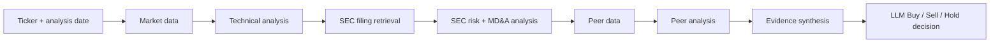

# Financial Research Agent

A LangGraph-based research agent for combining market data, technical indicators, news, insider activity, peer performance and SEC filings into a structured investment research workflow.

The project is designed as a research and decision-support system rather than a black-box stock predictor. It focuses on **multi-source evidence gathering, explicit orchestration and historical evaluation**.

## What it does



The current implementation uses a LangGraph `StateGraph` to pass structured state through each stage of the workflow.

## Current capabilities

### Market and technical analysis

- Historical OHLCV retrieval with `yfinance`
- SMA, MACD, RSI, ATR, ADX, Bollinger Bands and momentum signals
- Historical date support for research/backtesting runs

### News and sentiment

- Alpha Vantage news sentiment as the primary source
- Finnhub + Gemini fallback when required
- Cached responses to reduce repeat API calls
- Structured sentiment summaries used in final synthesis

### Insider and peer research

- Insider transaction data via Finnhub
- Peer discovery and price comparison
- Peer sentiment and relative performance analysis

### SEC filing analysis

- 10-K / 10-Q retrieval using `sec-edgar-downloader`
- Risk-factor and MD&A extraction
- Gemini-based summarisation and sentiment analysis
- Cached SEC analysis for repeated runs

### Decision synthesis

The final stage combines the available signals and asks the model to produce a Buy / Sell / Hold recommendation.

This output is intended for experimentation and model evaluation, not financial advice.

## Historical evaluation

The repository includes two experimentation tools beyond single-ticker execution.

### Backtesting

`backtest_runner.py` runs the full pipeline across historical trading days and records:

- model recommendation
- close price on the analysis date
- subsequent 1-day, 5-day, 14-day and 30-day prices

```bash
python backtest_runner.py AAPL --start 2024-05-01 --end 2024-05-31
```

### Ablation studies

`ablation_study.py` replays logged decision prompts with selected evidence removed, allowing experiments such as:

- recommendation without news evidence
- recommendation without peer evidence
- comparison with the complete prompt

The purpose is to measure whether individual information sources materially change model behaviour rather than assuming every additional signal is useful.

## Tech stack

- Python 3.11+
- LangGraph
- Gemini
- OpenAI
- pandas
- yfinance
- Finnhub
- Alpha Vantage
- SEC EDGAR
- BeautifulSoup / pdfplumber
- `ta`
- pytest

## Repository structure

```text
analysis/                Technical, sentiment, insider, peer and SEC analysis
data_sources/            External data integrations
decision/                Final model decision logic
tests/                   Unit tests
run_agent.py             LangGraph pipeline for a single analysis date
backtest_runner.py       Historical experiment runner
ablation_study.py        Evidence ablation experiments
config.py                Environment/API configuration
data/                     Runtime-downloaded data and caches
cache/                    Cached analysis artefacts
results/                  Experiment outputs
```

## Quick start

### 1. Install dependencies

```bash
python -m venv .venv
source .venv/bin/activate   # Windows: .venv\Scripts\activate
pip install -r requirements.txt
```

### 2. Configure API keys

Create a `.env` file containing the providers you want to use:

```ini
GEMINI_API_KEY=your-gemini-key
ALPHAVANTAGE_API_KEY=your-alpha-vantage-key
FINNHUB_API_KEY=your-finnhub-key
OPENAI_API_KEY=your-openai-key
```

`OPENAI_API_KEY` is currently used by the ablation tooling.

### 3. Run the agent

Current date:

```bash
python run_agent.py AAPL
```

Historical date:

```bash
python run_agent.py AAPL --date 2024-05-01
```

## Testing

```bash
pytest
```

The current test suite covers core data-fetching, parsing, sentiment and technical-analysis behaviour.

## Design choices

### Why multiple evidence sources?

A single sentiment or technical signal is easy to overfit or overinterpret. The project intentionally combines heterogeneous evidence so their contribution can be measured independently.

### Why LangGraph?

Each research stage writes explicit fields into a shared state object, which makes orchestration and intermediate evidence inspectable. The current graph is intentionally straightforward; richer routing is part of the roadmap below.

### Why cache model/data calls?

Historical experimentation can otherwise become slow and expensive. News and SEC analysis are cached so repeated evaluations can reuse the same information.

## Known limitations

This repository is an experimental research system and still has important limitations:

- the current graph is primarily sequential rather than parallel/conditional
- historical data retrieval needs stricter point-in-time guarantees before backtest results should be treated as robust
- several external APIs impose rate limits and availability constraints
- final recommendations are generated by an LLM and can be unstable
- the existing evaluation records future prices but does not yet provide a complete portfolio-performance framework

## Roadmap

Planned improvements include:

- parallel specialist branches for technical, news, insider, peer and SEC research
- conditional routing when evidence is missing or stale
- an evidence aggregator and critic stage before final synthesis
- explicit confidence / disagreement handling
- strict point-in-time data controls to eliminate historical leakage
- richer metrics for directional accuracy, calibration and baseline comparison
- macroeconomic, options and sector-context analysis
- stronger provider abstraction across Gemini, OpenAI and other model backends
- CI, structured outputs, tracing and broader test coverage
- lightweight API/demo layer for interactive research

## Disclaimer

This project is for research and educational use only. It is not investment advice and should not be used as the sole basis for financial decisions.